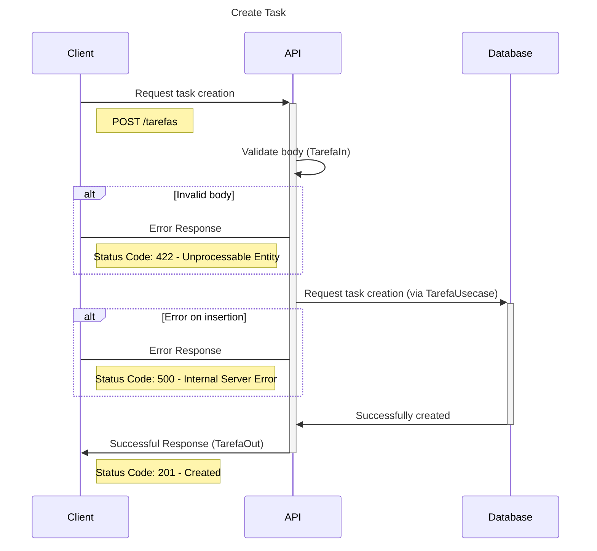
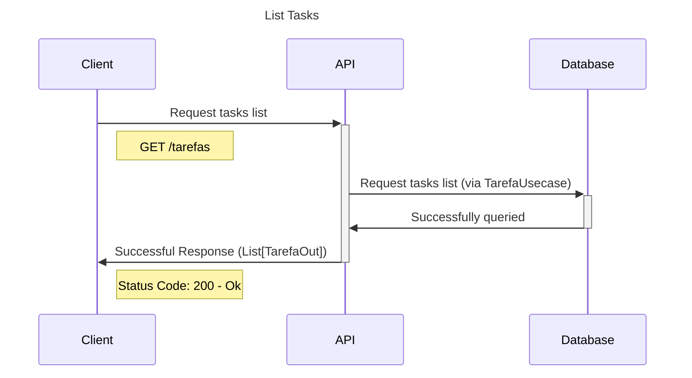
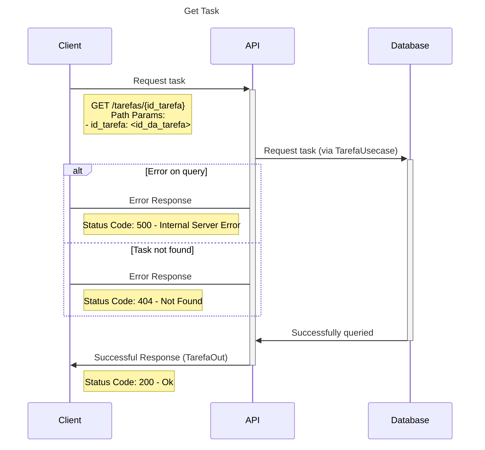
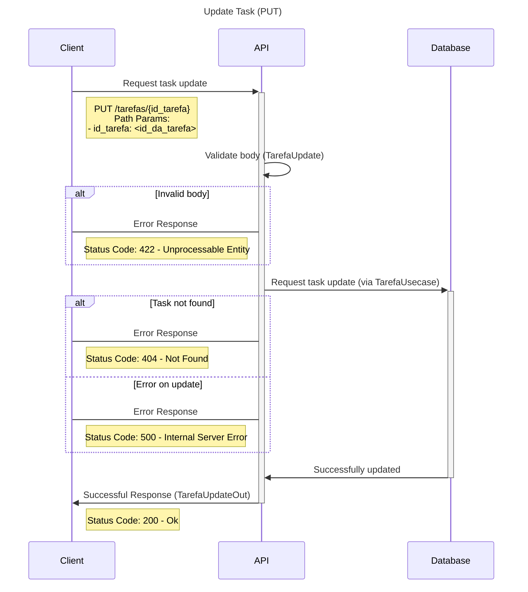
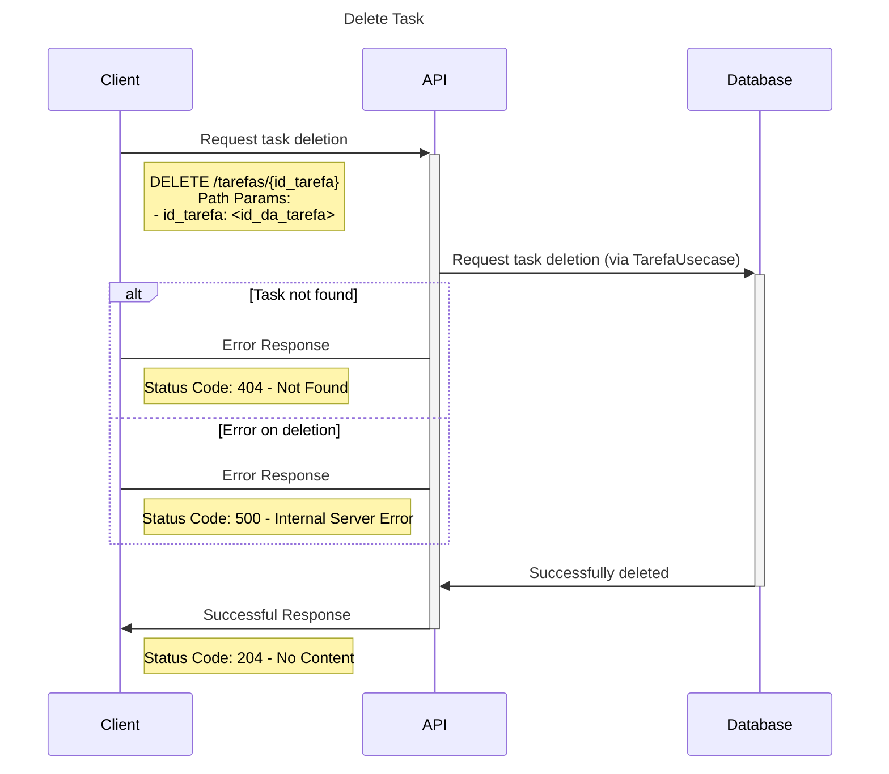

# API de Tarefas

## Diagramas de sequência para o módulo de Tarefas

### Diagrama de criação de tarefa

### Diagrama de listagem de tarefas

### Diagrama de detalhamento de uma tarefa

### Diagrama de atualização de tarefa

### Diagrama de exclusão de tarefa

